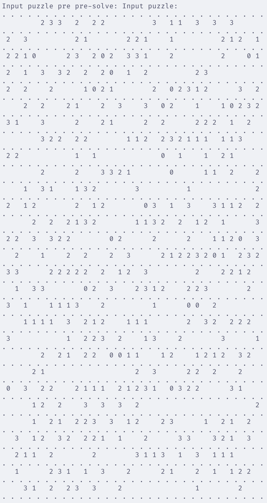
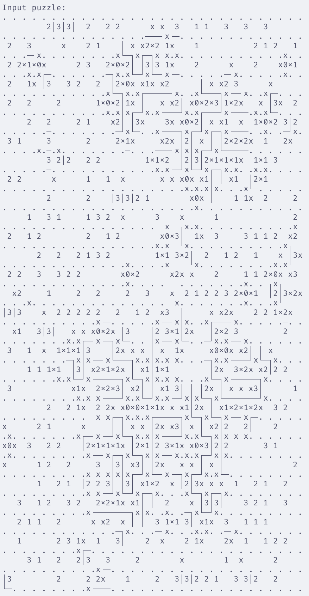
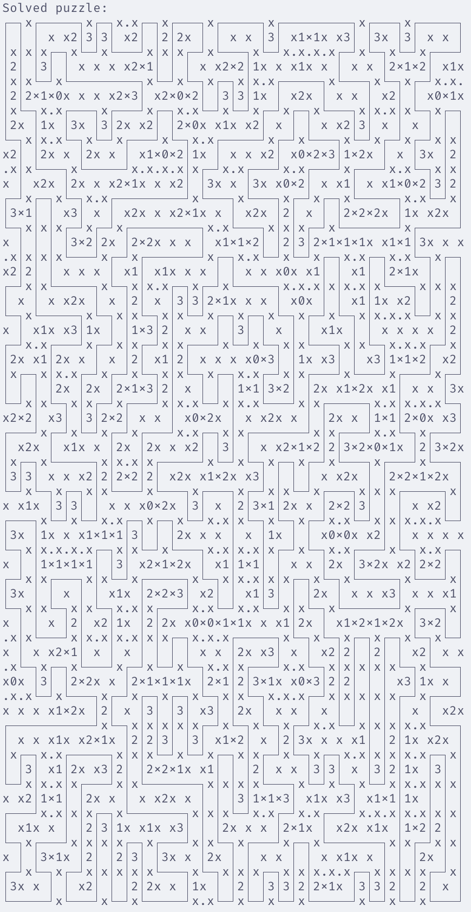

# Slitherlinker-Solver

This is a part of slitherlinker project that actually solves [slitherlink](https://jonathanolson.net/slitherlink/) puzzles.

Accepts files as input, content should be in format of puzzles same as https://slitherlink.neocities.org



There is a pre-solve step that fills in the super simple patterns by default for you



Output:



As experiment, it uses 3 SAT solvers.

1. [splr](https://crates.io/crates/splr)
2. [varisat](https://docs.rs/varisat/latest/varisat/)
3. [z3](https://crates.io/crates/z3)

At one point solve was very inefficient, and only one of those managed to calculate grids larger than 10x10. Turns out, it was on me, and this now can easily solve 30x30 puzzles in under a second.

Example usage:

```
cargo run --release 10x10d2:3a2223a32b211a3c3a1a12a23c2b3d33c02b2c20a21a1a3b1a12a112a3e221a3k2c2a
```

