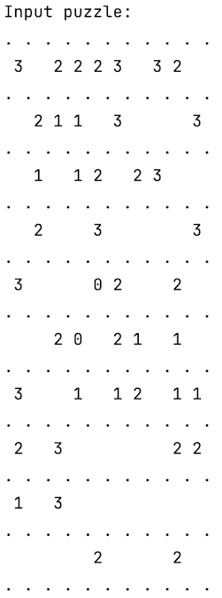
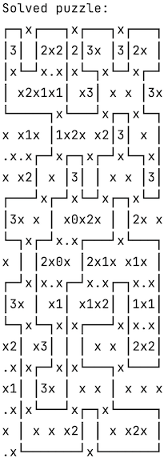

# Slitherlinker-Solver

This is a part of slitherlinker project that actually solves slitherlink puzzles.

Accepts files as input, content should be in format of puzzles similar to https://slitherlink.neocities.org

There's also a hacky example running by default

Output:

